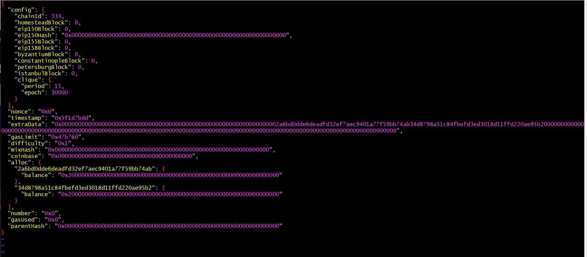

# Blockchain Wk 18 homework

### Setting up a network:

1. Create directory for all the files
2. Create a new account for every node in the network.
    * the full path to geth or puppeth is /c/Users/drbri/FinTech_Bootcamp/blockchain/geth-alltools-windows-amd64-1.9.16-ea3b00ad/Blockchain-Tools/geth(puppeth) so for simplicity I will just type ./geth(puppeth)
    * use ./geth account new --datadir (account name) I used node1, node2, and node3
    * the flag --datadir specifies the name of the new account
    * Don't forget what password you used
    * Record the addressess of each account created
3. Create the Genesis Block
    * use putteth to help generate the block ./puppeth
    * name the network (nettymcnetfacenet)
    * configure the block
        * choose clique
        * paste the address of each account(s) you want to be a sealer in the PoA network
        * paste the address of each account(s) you want to be prefunded 
        * Choose a chain ID, 333 is good
        
        
    * export the configured block, wither in the same directory or into a config directory
4. initialize each node
    * Use ./geth init ./nettymcnetfacenet_config/nettymcnetfacenet.json --datadir node1
    * init tells get to do an initialization
    * the location of the genesis block is specified
    * the flag --datadir says which account (node) to initialize
5. Start the nodes in the network
    * for the first node which will also act as the bootnode use the command ./geth --datadir node1/ --rpc --networkid 333 --unlock '0x2A6BD0DDe6dEaDFd32Ef7AEC9401A77f59bb74ab' --password password.sec --mine --allow-insecure-unlock --port 30303 --rpcapi 'net, db, miner, clique, admin, eth, web3'  
        * everything must be in one  (very) long line
        * the flag datadir is the location of the data for this node
        * the flag rpc (or soon http) makes this node open to the outside network, this only needs to be a single node
        * the flag networkid is the chain ID used in setting up the genesis block (333 in this case)
        * the flag unlock unlocks the address and uses the password from creating of the address which is stored in the password.sec file (all nodes have the same password here)
        * the flag mine starts the node mining
        * geth does not like a http enabled note to be unlocked, so the flag allow-insecure-unlock tells geth to ignore that constraint
        * the flag port gives a port to the enode address, and needs to be unique for each node
        * the flag rpcapi allows the use of the geth console (will be used later to add a new node)
        * after the nodes starts up, write down the enode address for this node
    * for subsequent node use the command ./geth --networkid 333 --datadir node2 --mine --unlock '0x34D8798a51C84FbEFd3Ed3018d11FFd220AE95B2' --password ./password.sec --allow-insecure-unlock --port 30304 --bootnodes "enode://b2f2f8b49d368f9e033164eb79205922e933180fb963a163de10888ded5215a336006a3b5dacc12910bbec3941874ac3414968b90bde919f15ea84c4a53f0013@127.0.0.1:30303" --ipcdisable
        * most flags are the same 
        * the flag ipcdisable tell the system not to care that two very similar processes are occuring
        * the flag bootnodes tells the subsequent nodes where to find the common node 
        * if everything is right, you should see the nodes talking to each other after starting
6. Open Mycrypto and connect to our local network
    * open my crypto and on the lower left of the screen click on "change network"
    
        * on the lower left again, click on "add custom node"
        
        * in the dialog box where it says "network" choose custom
                
        * complete the rest of the field, with network name, chainID (the 333 again), network address (http://127.0.0.1:8545)
        
        * click save
    * click keystore file
        * choose the keystore file for the rpc enabled node and type in the password of the node
        
        * you should now see the account for that node 
    * do do a transaction, enter the target accountnumber, the amount of eth, etc 
    
    * transaction complete
    
    
7. to allow new nodes to be sealers on the network you use the GETH console, you need at >50% of nodes to agree to let the new node in. 
    * restart node1 but with the command ./geth --datadir node1/ --rpc --networkid 333 -unlock '0x2A6BD0DDe6dEaDFd32Ef7AEC9401A77f59bb74ab' --password password.sec --mine --allow-insecure-unlock --port 30303 --rpcapi 'net, db, miner, clique, admin, eth, web3' console
    * restart node2 but with ./geth --networkid 333 --datadir node2 --mine --unlock '0x34D8798a51C84FbEFd3Ed3018d11FFd220AE95B2' --password ./password.sec --allow-insecure-unlock --port 30304 --bootnodes "enode://b2f2f8b49d368f9e033164eb79205922e933180fb963a163de10888ded5215a336006a3b5dacc12910bbec3941874ac3414968b90bde919f15ea84c4a53f0013@127.0.0.1:30303" --ipcdisable console
        * the command console starts the geth console
    * in each console type clique.propose("0x17E98AB03A727F4c85EC94553109BE990C0bc9C2", true), to tell the network what node to create as a sealer.
    * type clique.getSigners() to confirm the node was added as signer
    * clique.discard("0x17E98AB03A727F4c85EC94553109BE990C0bc9C2") once it is added, you discard the proposal 
    
8. a common bootnode for all the nodes to use on the machine.
    * use ./bootnode -genkey boot.key 
    * -genkey tells it to generate the bootnode key and save it in the file boot.key
    * use ./bootnode -nodekey boot.key -addr :30305 to start the bootnode
        * the flag nodekey tells it where to find the previously generated key 
        * the flag -addr specifies the port for the enode address used by the bootnode
        * copy down the enode address and use it in place of the enode address for the initial node
        * ./geth --datadir node1/ --rpc --networkid 333 -unlock '0x2A6BD0DDe6dEaDFd32Ef7AEC9401A77f59bb74ab' --password password.sec --mine --allow-insecure-unlock --port 30303 --rpcapi 'net, db, miner, clique, admin, eth, web3' --bootnodes "enode://9a9e32107af9dfce17a194fa6af4721fcd5b6fef6cdc7ffc759c4f685d1443cf6ad774a85df7d20926aadf4d8e427e1df927fd5f629148455fef64a9aa08c72a@127.0.0.1:0?discport=30305" console
        * ./geth --networkid 333 --datadir node2 --mine --unlock '0x34D8798a51C84FbEFd3Ed3018d11FFd220AE95B2' --password ./password.sec --allow-insecure-unlock --port 30304 --bootnodes "enode://9a9e32107af9dfce17a194fa6af4721fcd5b6fef6cdc7ffc759c4f685d1443cf6ad774a85df7d20926aadf4d8e427e1df927fd5f629148455fef64a9aa08c72a@127.0.0.1:0?discport=30305" --ipcdisable console

    

